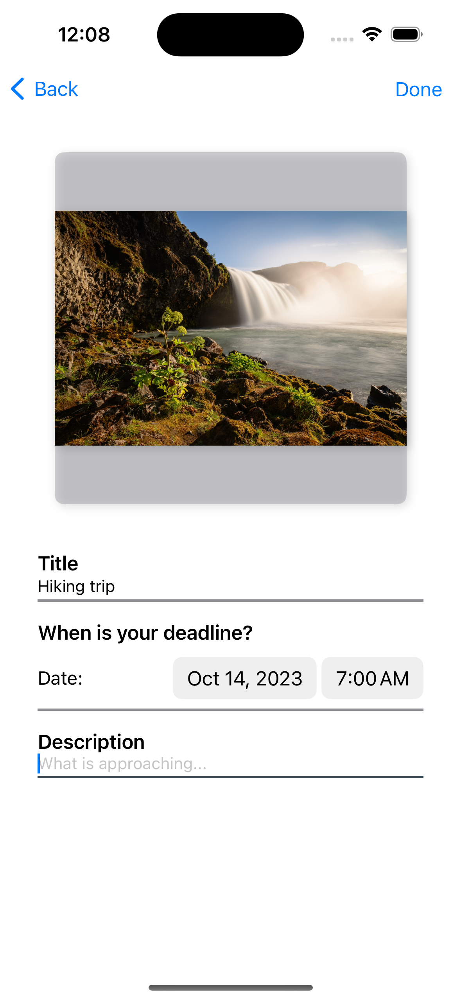
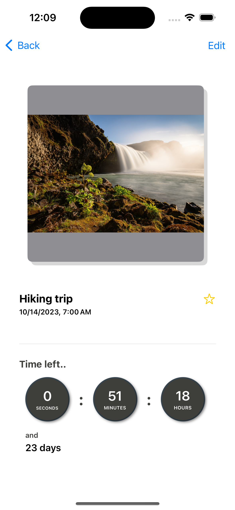
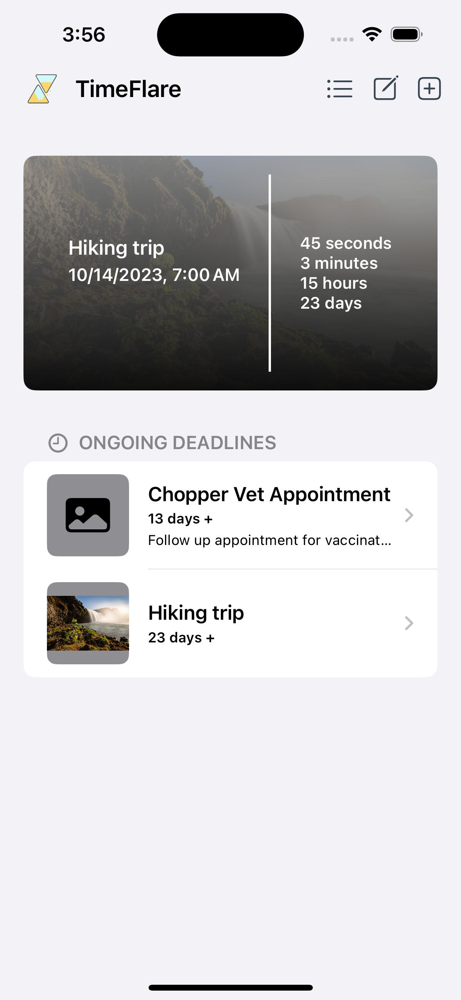
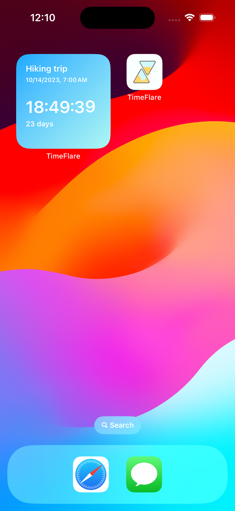
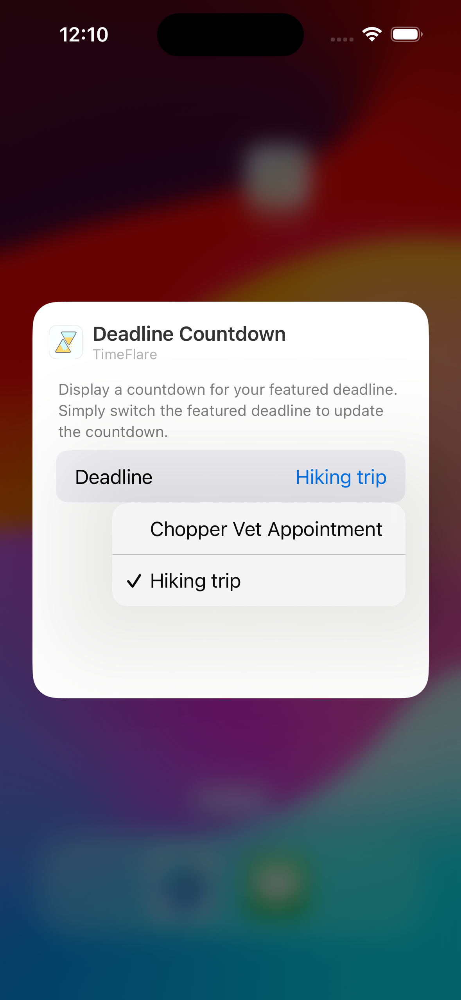

<!--
*** Thanks for checking out the Best-README-Template. If you have a suggestion
*** that would make this better, please fork the repo and create a pull request
*** or simply open an issue with the tag "enhancement".
*** Don't forget to give the project a star!
*** Thanks again! Now go create something AMAZING! :D
-->

<!-- PROJECT SHIELDS -->
<!--
*** I'm using markdown "reference style" links for readability.
*** Reference links are enclosed in brackets [ ] instead of parentheses ( ).
*** See the bottom of this document for the declaration of the reference variables
*** for contributors-url, forks-url, etc. This is an optional, concise syntax you may use.
*** https://www.markdownguide.org/basic-syntax/#reference-style-links
-->
[![LinkedIn][linkedin-shield]][linkedin-url]

<!-- PROJECT LOGO -->
 

    
<h3 align="center" style="font-size:24px;">TimeFlare</h3>

  

    A simple deadline tracking application that displays countdowns of the time left in the deadline.   The application widget provides a quick glance to any ongoing deadline.
  

<!-- ABOUT THE PROJECT -->
## About The Project

    
    
    
    
    

 
TimeFlare allows users to create as many deadlines as they want. Users can quickly glance at each deadline to see how much time they have left, down to the number of seconds. TimeFlare also supports a widget, which can be added to the user's home screen to see a countdown for a deadline of their choice. 
 
 
TimeFlare is mainly written in SwiftUI. It interfaces with UIKit to allow the user to pick images from their photo library. Below are some capabilities used in the project: 

* SwiftData to locally store deadlines for users.
* Widget extension that uses the new app intent APIs to make the widget configurable. 
* An App Group to write ongoing deadlines to a shared JSON file (The widget can access this info when the main application is not running).

<!-- 
* Deadlines are stored locally in the user's device. This was achived by using SwiftData to perform all CRUD database operations.
* The project supports SwiftData lightweight migration as of today. A new model schema can be supported by adding a new migration plan to the project.
* All ongoing deadlines are written into a shared JSON file written 
<--- 

<!-- SwiftData Implemenation -->
## SwiftData 

The application performs all CRUD database operations using SwiftData. All operations are done on the main queue to facilitate the cascading UI updates.

The model container only manages the schema for the Deadline model, which encapsulates the title, description, end date, and image of a deadline. The application's container also supports a deadline migration plan by leveraging `SchemaMigrationPlan.` All versioned schemas are kept in the project for record purposes, and a single typealias declares the actual Deadline data type.

Most CRUD operations are done through a single manager class, the `DeadlineStorage.` The `DeadlineStorage` utilizes sort and fetch descriptors to return the deadlines based on a user's preference. The only operation that is not done from the `DeadlineStorage` are database updates, which are done directly from the view code by simply updating the properties on model `Deadline` objects.

Although SwiftData supports initializing and configuring the model container and context directly from the view code, we wanted to decouple view code from SwiftData business logic. Thus, the project does not use any @Query property wrappers to fetch data from the model container. Instead, all deadline data is accessed througha single `DeadlineManager,` an observable object that exposes the deadlines as publishers. The `DeadlineManager` helps abstract any business logic related with refreshing deadlines and fetching user preferences from UserDefaults.

<!-- App Group Implemenation -->
## TimeFlare App Group

The TimeFlare application uses an `App Group` capability to share deadline information across the main application and app extensions. From the `Apple Developer Portal,` we created an App Group identifer. Then, the App Group capability was added to both the main application target and the widget target. 

Both the main application and the Widget extension used the App Group container URL to write/read deadline information. The `DeadlineSummaryFileService` takes care of doing these operations.  

<!-- Widget Implemenation -->
## TimeFlare Widget 

TimeFlare supports a small widget to display glanceable information about a deadline. The widget is configurable to allow the user to select any ongoing deadline. To support a dynamic countdown, the widget displays the time remaining using a SwiftUI Text view with a timer format. 

To make the widget configurable, TimeFlare uses the new `WidgetConfigurationIntent,` an app intent supported from iOS 17. The `TimeFlareWidgetConfigurationIntent`only takes a single parameter for the selected deadline summary, if any.

To use the `DeadlineSummary` struct as a parameter for the `WidgetConfigurationIntent,` the `DeadlineSummary` conforms to AppEntity. This helps to expose the custom type to system services. The entity query reads all `DeadlineSummary` objects stored in the `App Group` contianer. It uses the `DeadlineSummaryFileService` to return the suggested deadline entities and the default entity.

The timeline provider of the widget uses the `TimeFlareWidgetConfigurationIntent` configuration to incorporate the user selected deadline into the timeline entries. Once a user selects a deadline, the timeline is not updated unless the user selects another deadline or edits the currently selected deadline in the main application. To avoid many policy refresh calls to WidgetKit, TimeFlare sets the reload policy as `never` and displays a special timeline entry at the end, which informs the user that the deadline is over.

<!-- ACKNOWLEDGMENTS -->
## Acknowledgments

* [SwiftLee](https://www.avanderlee.com/): For all tutorials on SwiftUI. It's an great blog to learn anything on Swift!
* [WWDC23](https://developer.apple.com/wwdc23/): For SwiftData and WidgetKit sessions
* [Best-README-Template](https://github.com/othneildrew/Best-README-Template/tree/master): For this awesome README.md template

<!-- MARKDOWN LINKS & IMAGES -->
<!-- https://www.markdownguide.org/basic-syntax/#reference-style-links -->
[linkedin-shield]: https://img.shields.io/badge/-LinkedIn-black.svg?style=for-the-badge&logo=linkedin&colorB=555
[linkedin-url]: https://www.linkedin.com/in/ricardo-sanchez-macias/
[product-screenshot]: images/screenshot.png
